# GitHub Change Workflow Reference

This is the compact reference for the repository's AI-assisted change process.
See [`CONTRIBUTING.md`](../CONTRIBUTING.md) for the step-by-step operating guide.

## Workflow Labels

Create these labels in GitHub before running the first trial:

| Label | Meaning |
| --- | --- |
| `needs-planning` | The request needs an AI implementation proposal. |
| `plan-ready` | The proposal is ready for human review. |
| `changes-requested` | Human feedback must be incorporated before approval. |
| `approved-for-build` | A human has authorized the documented plan for manual or AI implementation. |
| `approved-for-ai-build` | A human has explicitly authorized Codex to implement the approved plan. |
| `in-progress` | Implementation is underway. |
| `preview-ready` | CI and the preview are ready for human review. |
| `blocked` | Progress requires a decision, permission, or external change. |
| `needs-decision` | Planning requires a material human decision before approval. |
| `split-proposed` | Codex proposed decomposing this issue for human review. |
| `approved-for-split` | An authorized human approved creation of the proposed child issues. |
| `split-parent` | This issue was decomposed into bounded child issues. |

Issue-category labels are `website`, `engineering`, `devops`, and `workflow`.
Additional classification labels are `content`, `design`, `feature`, `bug`,
`accessibility`, `seo`, and `maintenance`.

Every tracked-file change requires an originating issue. Use Website change for
visitor outcomes, Engineering change for application internals, and DevOps or
workflow change for delivery, repository policy, and AI process. Documentation,
dependencies, maintenance, and urgent work follow the same planning and approval
gates; they are not exceptions.

Normal lifecycle:

```text
needs-planning → plan-ready → approved-for-build → in-progress → preview-ready → done
```

Remove superseded state labels as work advances. A closed issue is “done”; a
separate `done` label is not required.

Planning also protects the implementation window from oversized semantic scope:

```mermaid
stateDiagram-v2
    direction LR

    state "needs-planning" as NeedsPlanning
    state "Codex planning<br/>(read-only)" as Planning
    state "plan-ready" as PlanReady
    state "changes-requested" as ChangesRequested
    state "needs-decision" as NeedsDecision
    state "split-proposed" as SplitProposed
    state "approved-for-split" as ApprovedSplit
    state "Trusted split publisher<br/>(GitHub App token)" as SplitPublisher
    state "split-parent" as SplitParent
    state "approved-for-build" as ApprovedBuild
    state "approved-for-ai-build" as ApprovedAiBuild
    state "Codex implementation<br/>(no GitHub write credential)" as Implementation
    state "Trusted PR publisher<br/>(GitHub App token)" as PrPublisher
    state "in-progress" as InProgress
    state "preview-ready" as PreviewReady
    state "blocked" as Blocked

    [*] --> NeedsPlanning: human applies label
    NeedsPlanning --> Planning: GHA validates actor and snapshot
    ChangesRequested --> Planning: human requests focused revision
    Planning --> PlanReady: focused
    Planning --> NeedsDecision: material decision required
    Planning --> SplitProposed: split required

    NeedsDecision --> ChangesRequested: human resolves decision
    PlanReady --> ChangesRequested: human requests changes
    PlanReady --> ApprovedBuild: human approves plan
    ApprovedBuild --> ApprovedAiBuild: human authorizes AI build
    ApprovedAiBuild --> Implementation: GHA validates frozen plan
    Implementation --> PrPublisher: validated patch and report
    PrPublisher --> InProgress: draft PR opened

    SplitProposed --> ApprovedSplit: human approves decomposition
    ApprovedSplit --> SplitPublisher: GHA revalidates actor and fingerprint
    SplitPublisher --> SplitParent: every child confirmed
    SplitParent --> [*]: parent closed as not planned

    Planning --> Blocked: generation or publishing failure
    Implementation --> Blocked: generation or publishing failure
    SplitPublisher --> Blocked: partial or publishing failure
    Blocked --> NeedsPlanning: retry planning label
    Blocked --> ApprovedAiBuild: retry AI-build label
    Blocked --> ApprovedSplit: retry split approval

    InProgress --> PreviewReady: checks pass and human reviews preview
    PreviewReady --> [*]: human merges and closes issue
```



`needs-decision`, `split-proposed`, `approved-for-split`, and `split-parent`
block automated implementation. A human resolves a decision through planning
discussion. For a proposed split, a human reviews the decomposition before
applying `approved-for-split`; model output alone never authorizes child creation.

## Planning Prompt

```text
Analyze this issue but do not modify the repository yet.

Classify the issue as `focused`, `needs-decision`, or `split-required` using
observable structure rather than estimated time, token use, or model effort.
Split when there are independently valuable outcomes, unrelated change
surfaces, unresolved material decisions, or criteria that cannot be validated
together. Create a concise implementation proposal containing:
1. Your understanding of the problem
2. The intended visitor or business outcome
3. Recommended design and content changes
4. Components and files likely to change
5. Acceptance criteria
6. Testing and validation plan
7. Accessibility considerations
8. Risks, assumptions, or decisions that require human input
9. Journal impact: entry in this change, follow-up after evidence/merge, or no
   entry, with one sentence explaining why

Use scripts/post-issue-plan with this issue number to post the complete proposal
as a GitHub issue comment. Replace needs-planning or changes-requested with
plan-ready after the comment is posted. If GitHub access or posting fails, stop
and report the blocker. Do not leave the plan only in the Codex conversation.
Wait for explicit approval before changing code.
```

The newest comment containing the `codex-implementation-plan` marker starts the
plan of record. Later owner feedback and focused Codex amendments remain part of
that record; revisions do not need to repeat the entire plan. A human may ask
for a consolidated replacement when that would make approval clearer. Applying
`approved-for-build` freezes the marked plan and subsequent planning discussion
as the approved scope. Codex must verify the label and reread that frozen record
before implementation.

## Label-triggered automation

When repository automation is enabled, trusted human label changes start three
stages:

| Label | Automated result |
| --- | --- |
| `needs-planning` | Codex posts one concise marked plan and applies `plan-ready`. |
| `changes-requested` | Codex answers only the new feedback and returns the issue to `plan-ready`. |
| `approved-for-ai-build` | Codex prepares a validated patch only when `approved-for-build` is also present; a separate job opens one draft PR and applies `in-progress`. |
| `approved-for-split` | A GitHub-only publisher revalidates the proposal, creates or reuses marked children, reconciles the parent checklist, and closes the confirmed parent as not planned. |

The label event starts with trusted code from the default branch. It verifies
the actor, issue state, planning snapshot, and replay fingerprint, then writes
that untrusted snapshot to `codex-input.json`. The OpenAI generation job has no
GitHub write credential, checkout credentials are not persisted, and Codex edits
only a disposable checkout. For implementation, `codex.patch` contains the
repository changes while `codex-output.json` contains the schema-validated
public report; neither grants authority to publish.

A separate trusted job downloads both artifacts, revalidates their public text
and patch paths, applies the patch to a fresh default-branch checkout, and runs
the required suite. Only then does it create a short-lived, repository-scoped
GitHub App token, branch, commit, push, and draft pull request. That publisher
has no OpenAI key. Prompts guide model behavior; permissions, absent
credentials, fresh checkouts, validation, and short-lived tokens enforce the
security boundary.

The split publisher uses the same boundary without invoking Codex. It rereads
the structured proposal embedded in the planning comment, revalidates its
fingerprint, and only then uses the App token. Authorization belongs to the
allowlisted, write-level human who applies the label or starts a recovery
dispatch. Issue and child text remain untrusted input.

Replayed events use planning fingerprints and stable child markers to resume
safely.
Failures apply `blocked` and link the workflow run; resolve the cause, remove
`blocked`, and reapply the stage label. An implementation failure removes only
`approved-for-ai-build`, preserving `approved-for-build` for a deliberate retry.
Successful AI implementation removes both approval labels.

Each split child has one bounded outcome, testable criteria, explicit
dependencies, included/excluded scope, a parent link, and a stable hidden
marker. Only suggested non-state labels present on the parent are copied;
`needs-planning` is never automatic. Text references represent dependencies in
this version. The parent receives a deterministic checklist and closes only
after every child is confirmed. Partial failure preserves children, leaves the
parent open, removes `approved-for-split`, and applies `blocked`. Conflicting
markers stop for human review.

Codex generations use an explicit stage policy:

| Stage | Model | Reasoning effort |
| --- | --- | --- |
| Plan and revise | `gpt-5.6-luna` | Low |
| Implement | `gpt-5.6-terra` | Medium |

This policy controls cost without weakening the implementation default. If a
planning result is inadequate, escalate first to Terra at low or medium effort.
Sol/high is reserved for an exceptional retry after inspecting the lower-cost
result; it requires a separately reviewed workflow change and is never exposed
as a label or dispatch option. Restore the defaults after that retry.

For the first three to five representative post-merge issues, record the stage,
model, result quality, retries, and OpenAI project usage in issue #30. Evaluate
quality and retry rate alongside project usage before making another model
change; Actions duration is not a cost measure. Recheck official model
availability and pricing whenever the policy changes.

Automation does not apply `approved-for-build` or `preview-ready`, merge, push
to `main`, publish a release, or deploy. Those remain human decisions.

For manual implementation, apply `approved-for-build`, create a non-
`codex/issue-*` branch, open a pull request linked to the issue, and move the
issue to `in-progress`. Applying general approval alone never starts Codex.
For AI implementation, apply `approved-for-ai-build` after general approval;
the `codex/issue-<number>` branch namespace is reserved for that automation.
Create the new label before enabling this workflow change. Workflow changes take
effect only for new runs after merging to the default branch and do not alter an
already-running job. Already-approved issues can proceed manually; AI work needs
the new label after rollout.

Journal content is visitor-facing scope. Include it in the originating pull
request only when the approved plan explicitly authorizes the entry. Otherwise,
open a separate website-content issue and use the same planning and approval
gates. A journal assessment does not require an entry for every change.

## Implementation Prompt

```text
The implementation plan for this issue is approved and the issue has the
approved-for-build label. Implement only the approved scope.

Create a branch, follow all repository instructions, reuse existing components,
run every required validation command, and open a pull request linked to the
issue. Include screenshots or clear visual verification instructions,
accessibility considerations, and known limitations. Do not merge the pull
request.
```

## Review Prompt

```text
Review this pull request against the originating issue, approved plan,
repository instructions, product brief, and design principles.

Focus on correctness, scope compliance, mobile layout, accessibility, visual
regressions, content accuracy, unsupported claims, tone, excessive complexity,
unnecessary dependencies, missing tests, and missing screenshots. Do not
approve or merge your own implementation. Report findings with severity and
recommended corrections.
```

## Human Visual Review

- Does the site look more credible?
- Is the target audience clear?
- Is the page easier to scan?
- Does the copy sound like Todd?
- Are all claims accurate and supportable?
- Is the primary call to action obvious?
- Does it work on a narrow mobile screen?
- Does it avoid generic AI imagery and jargon?
- Are spacing, typography, and alignment consistent?
- Does the change solve the originating issue?

## Protected Branch Settings

In GitHub, protect `main` with these settings:

- Require a pull request before merging.
- Require the `validate` status check and require branches to be current.
- Block direct pushes and force pushes.
- Do not allow bypasses for automated agents.
- Keep merge approval and branch deletion under human control.

These settings are mandatory for public operation. If protection becomes
unavailable or is removed, pause implementation and restore it before accepting
another change. The one-time release sequence and ongoing verification are in
the [`public repository checklist`](public-repository-checklist.md).

## Vercel Settings to Verify

- The GitHub repository is connected to the intended Vercel project.
- `main` is the production branch.
- Pull requests receive preview deployments and report their status to GitHub.
- The preview URL is copied into the pull request.
- Production deploys only after a human merges to `main`.

These are manual account settings and cannot be established by committed files.
